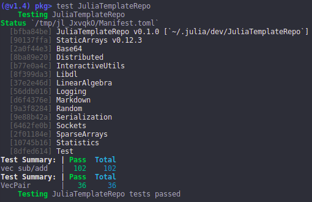
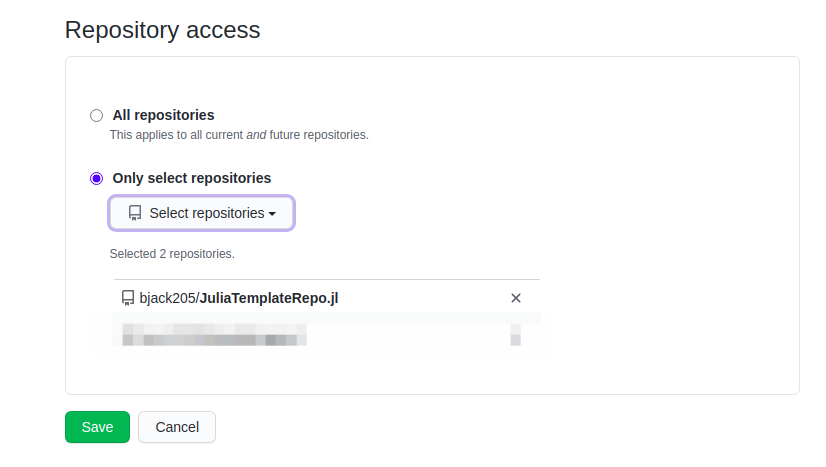
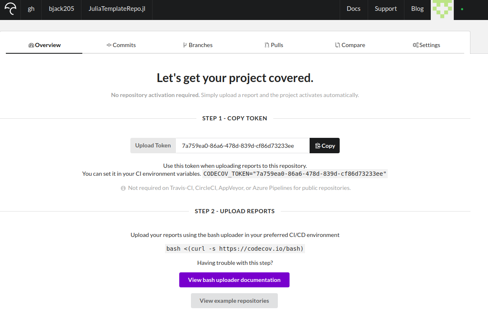
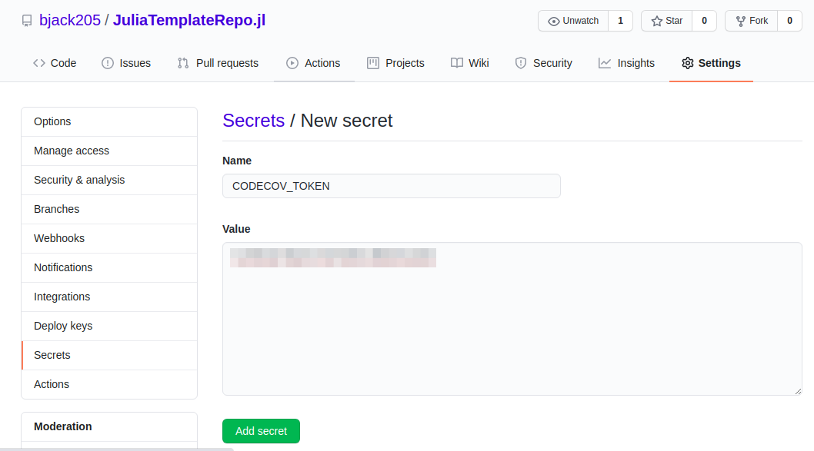
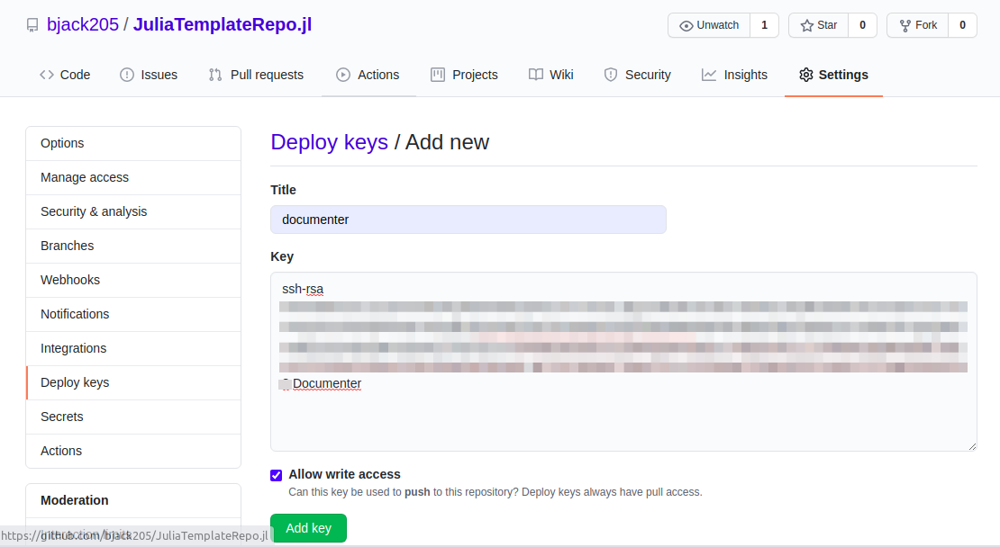
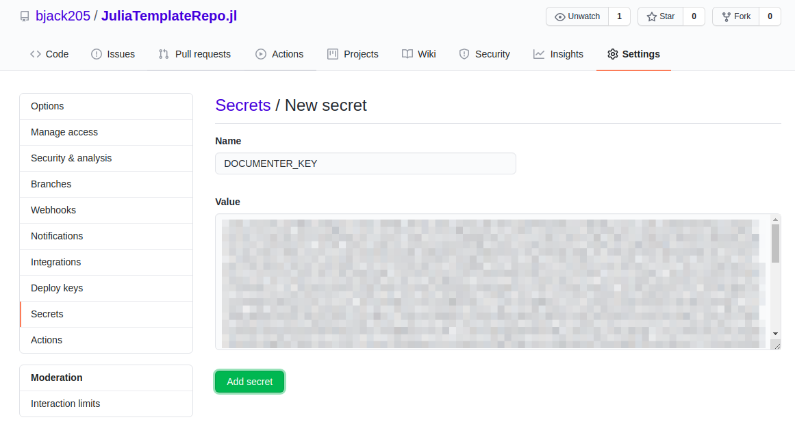

# Julia Template Repo
This repository is meant as a walk-through for setting up a new Julia package, complete with a test suite, CI, code coverage, and documentation.

## Creating a New Package
This is a summary of the instructions in the [Julia Pkg manual](https://julialang.github.io/Pkg.jl/v1/creating-packages/#**5.**-Creating-Packages-1).

1. Create a new repository on GitHub:
Follow the Julia package [naming conventions](https://julialang.github.io/Pkg.jl/v1/creating-packages/#Package-naming-guidelines-1). All julia package repos should have ".jl" at the end.
Do NOT initialize the repo with a README or license at this point.


2. After creating the repo you should see a screen that looks like the one below. Copy the
repo URL.


3. In your terminal on your computer, launch Julia. Generate the package files using the
package manager:

    ```julia
    ] generate JuliaTemplateRepo
    ```
    This will generate the `Project.toml` and a `src/JuliaTemplateRepo.jl` files.

4. Create a `README.md`. Use whatever editor you prefer.

5. Create a git repo, add the remote, and push changes. These instructions are also found
in the previous image.
    ```
    cd JuliaTemplateRepo
    git init
    git add -A
    git commit -m "first commit"
    git remote add origin https://github.com/bjack205/JuliaTemplateRepo.jl.git
    git push -u origin master
    ```

6. (optional) Delete local files and add to Julia `dev` folder
    ```
    cd ..
    rm -rf JuliaTemplateRepo
    ```
    Run Julia from your terminal and dev the package:
    ```
    ] dev https://github.com/bjack205/JuliaTemplateRepo.jl.git
    ```
    Alternatively, you can link to your local repository if you didn't delete it:
    ```
    ] dev /path/to/local/repo/JuliaTemplateRepo
    ```

## Adding Dependencies
Any registered package used by our new repo must be recorded in the `Project.toml` file.
The easiest way to add packages is via the package manger. For our package, we are going
to add [StaticArrays.jl](https://github.com/JuliaArrays/StaticArrays.jl) and LinearAlgebra
as dependencies.

To do this, we need to first activate the `Project.toml` file for our project using the
package manager:
```julia
] activate /path/to/JuliaTemplateRepo
```

Once activated, we add dependencies the exact same way we do normally:
```
(JuliaTemplateRepo) pkg> add StaticArrays
(JuliaTemplateRepo) pkg> add LinearAlgebra
(JuliaTemplateRepo) pkg> resolve
```

The last command isn't always needed, but is recommended, since it updates our `Manifest.toml`
file based on the contents of the `Project.toml` file.

If we open our `Project.toml` file we should now see our packages under the `[deps]` header:
```
name = "JuliaTemplateRepo"
uuid = "bfba84be-7fa7-49e4-96a7-8b4754465918"
authors = ["Brian Jackson <bjack205@gmail.com>"]
version = "0.1.0"

[deps]
LinearAlgebra = "37e2e46d-f89d-539d-b4ee-838fcccc9c8e"
StaticArrays = "90137ffa-7385-5640-81b9-e52037218182"
```

We now need to specify the versions of the non-standard packages we officially support.
The easiest---and more conservative---way to determine our compatibility is to restrict
the versions to those that are currently being used. We can query this using the package
manager:
```
(JuliaTemplateRepo) pkg> st
```
Which should return something like


Here we see that LinearAlgebra is a part of the standard library since it doesn't have an
associated version, and that we're using `StaticArrays` `v0.12.4`. Since all patches should
be backward-compatible, we will allow any of the `v0.12.x` versions of StaticArrays.

We add this compatibility requirement, along with our required Julia version, to the
`[compat]` section of our `Project.toml` file:

```
name = "JuliaTemplateRepo"
uuid = "bfba84be-7fa7-49e4-96a7-8b4754465918"
authors = ["Brian Jackson <bjack205@gmail.com>"]
version = "0.1.0"

[deps]
LinearAlgebra = "37e2e46d-f89d-539d-b4ee-838fcccc9c8e"
StaticArrays = "90137ffa-7385-5640-81b9-e52037218182"

[compat]
StaticArrays = "0.12"
julia = "1"
```

The Julia package registrator requires that all packages have upper-bounded compatibility
requirements.

Before committing our `Project.toml` file, we need to make sure our `Manifest.toml` file
isn't included in our repo, since this file is dependent on the environment of the user.
Add `Manifest.toml` to your `.gitignore` file.

## Adding Tests
Let's say we've added some code to our repo (check out `src/newcode.jl`) and now want to
add some unit tests. All unit tests live in the `test/` directory and are run via the
`test/runtests.jl` file. Typically the `runtests.jl` file loads in any packages needed
to run the tests, including `Test` and the actual package being tested, and then includes
files that have defined `@testset`s. See the `test/` directory for an example.

If you're using Julia v1.2+, we add the test dependencies the same way we add package
dependencies: via the package manager. We first activate the `test` environment:
```
] activate /path/to/JuliaTemplateRepo/test
```
and then add the packages
```
(test) pkg> add Test
(test) pkg> add StaticArrays
(test) pkg> add LinearAlgebra
```

Adding the `[compat]` entries for the test `Project.toml` is suggested, but not required.

We can now run the test suite using the package manager. It's usually a good idea to restart
Julia and run the command from the default environment:
```
] test JuliaTemplateRepo
```
which should return something similar to this:




## Setting Up CI
With a functional test suite, we are now ready to set up CI. Here we will demonstrate
how to do this with GitHub actions.

1. Open GitHub Actions panel in GitHub:


2. Click "set up a workflow yourself"


3. Rename the file to `CI.yml`


4. Paste the following code
```
name: CI
on:
  push:
    branches:
      - master
    tags: '*'
  pull_request:
jobs:
  test:
    name: Julia ${{ matrix.version }} - ${{ matrix.os }} - ${{ matrix.arch }}
    runs-on: ${{ matrix.os }}
    strategy:
      matrix:
        version:
          - '1.3'
        os:
          - ubuntu-latest
          - macOS-latest
          - windows-latest
        arch:
          - x64
    steps:
      - uses: actions/checkout@v1
      - uses: julia-actions/setup-julia@latest
        with:
          version: ${{ matrix.version }}
          arch: ${{ matrix.arch }}
      - uses: julia-actions/julia-runtest@latest
      - uses: julia-actions/julia-uploadcodecov@latest
        env:
          CODECOV_TOKEN: ${{ secrets.CODECOV_TOKEN }}
```
    Which runs Julia v1.3 (under `jobs/test/strategy/matrix/version`) on Ubuntu, Mac, and
    Windows (under `jobs/test/strategy/matrix/os`). The steps setup Julia, run the tests,
    and then upload the code coverage results to codecov. This will run on any pull request
    and on any push to the master branch.

5. Commit the file and GitHub will automatically start running the tests

6. Add the badge: Go back to the GitHub Actions pane and select the currently running
CI action and select "Create Status Badge", copy the badge link and paste it into the
top of your README file.


## Adding Code Coverage
This section will detail how to get code coverage reports via
[codecov.io](https://codecov.io/).

1. Go to [codecov.io](https://codecov.io/) and log in.

2. In GitHub, add your repo in the CodeCov App settings.
If you haven't set up codecov for your organization or account, configure it via the [GitHub App](https://github.com/apps/codecov).


3. In codecov.io, select the parent organization or account and select "Add new repository".
If your repo doesn't show up, you can navigate directly to it in the URL bar, e.g.
https://codecov.io/gh/bjack205/JuliaTemplateRepo.jl.

4. Copy the codecov token


5. Add token to GitHub secrets. In GitHub, navigate to the settings for your repo, select
"Secrets" from the toolbar on the left, and select "New Secret". Name the token `CODECOV_TOKEN`
and copy the token from codecov.io.



## Adding Documentation
This section details how to set up a documentation page using [Documenter.jl](https://github.com/JuliaDocs/Documenter.jl). This is a more concise version of the instructions included
in the documentation for that package.

1. In your repo, create a `docs/` directory, and a `docs/src/` directory that will conntain
all the source `.md` files for your documentation.

2. Create a `docs/make.jl` file. This file is responsible for building and deploying your
documentation. Here is the basic starting point:
```julia
using Documenter
using JuliaTemplateRepo  # your package name here

makedocs(
    sitename = "JuliaTemplateRepo",  # your package name here
    format = Documenter.HTML(prettyurls = false),  # optional
    pages = [
        "Introduction" => "index.md"
    ]
)

# Documenter can also automatically deploy documentation to gh-pages.
# See "Hosting Documentation" and deploydocs() in the Documenter manual
# for more information.
deploydocs(
    repo = "github.com/bjack205/JuliaTemplateRepo.jl.git",
)
```

3. Add documentation files to `docs/src`. Once the files are in `docs/src`, add them to
the `makedocs` command.

4. Add Documentation dependencies. Nearly identical to the tests, we need to add any
dependencies we use to build the documentation, which obviously must include Documenter.jl.
Activate the `docs/` directory and add Documenter
```
julia> ] activate docs
(docs) pkg> add Documenter
```
    Then add a `[compat]` entry for Documenter.

4. Add deploy keys for your repo. Install [DocumenterTools.jl](https://github.com/JuliaDocs/DocumenterTools.jl) and enter the following into your REPL
```
using DocumenterTools
using JuliaTemplateRepo                     # your package name here
DocumenterTools.genkeys(JuliaTemplateRepo)  # your package name here
```
    Copy the first public key (starts with `ssh-rsa` and ends with ` Documenter`).
    Go to your repository settings in GitHub and select "Deploy Keys". Add the deploy key,
    using `documenter` as the name.


    Then copy the very long environment variable and save it as the `DOCUMENTER_KEY` secret
    on GitHub:



5. Add a GitHub Action to build your documentation. Create a new GitHub action
(called `Documenter.yml`) and paste the following code:
```
name: Documentation

on:
  push:
    branches:
      - master
    tags: '*'
  pull_request:

jobs:
  build:
    runs-on: ubuntu-latest
    steps:
      - uses: actions/checkout@v2
      - uses: julia-actions/setup-julia@latest
        with:
          version: 1.3
      - name: Install dependencies
        run: julia --project=docs/ -e 'using Pkg; Pkg.develop(PackageSpec(path=pwd())); Pkg.instantiate()'
      - name: Build and deploy
        env:
          GITHUB_TOKEN: ${{ secrets.GITHUB_TOKEN }} # For authentication with GitHub Actions token
          DOCUMENTER_KEY: ${{ secrets.DOCUMENTER_KEY }} # For authentication with SSH deploy key
        run: julia --project=docs/ docs/make.jl
```
