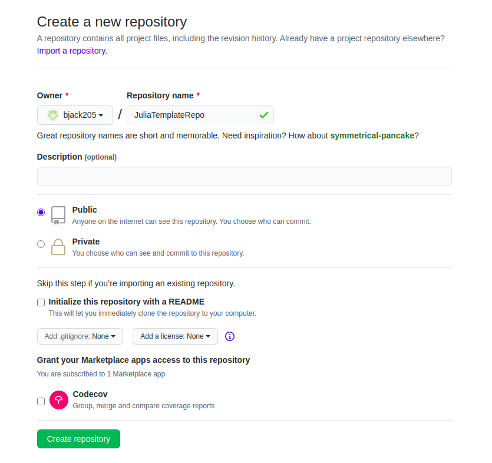

# Julia Template Repo
This repository is meant as a walk-through for setting up a new Julia package, complete with a test suite, CI, code coverage, and documentation.

## Creating a New Package
This is a summary of the instructions in the [Julia Pkg manual](https://julialang.github.io/Pkg.jl/v1/creating-packages/#**5.**-Creating-Packages-1).

1. Create a new repository on GitHub:
Follow the Julia package [naming conventions](https://julialang.github.io/Pkg.jl/v1/creating-packages/#Package-naming-guidelines-1). All julia package repos should have ".jl" at the end.
Do NOT initialize the repo with a README or license at this point.



2. After creating the repo you should see a screen that looks like the one below. Copy the
repo URL.


3. In your terminal on your computer, launch Julia. Generate the package files using the
package manager:

    ```julia
    ] generate JuliaTemplateRepo
    ```
    This will generate the `Project.toml` and a `src/JuliaTemplateRepo.jl` files.

4. Create a `README.md`. Use whatever editor you prefer.

5. Create a git repo, add the remote, and push changes. These instructions are also found
in the previous image.
    ```
    cd JuliaTemplateRepo
    git init
    git add -A
    git commit -m "first commit"
    git remote add origin https://github.com/bjack205/JuliaTemplateRepo.jl.git
    git push -u origin master
    ```

6. (optional) Delete local files and add to Julia `dev` folder
    ```
    cd ..
    rm -rf JuliaTemplateRepo
    ```
    Run Julia from your terminal and dev the package:
    ```
    ] dev https://github.com/bjack205/JuliaTemplateRepo.jl.git
    ```
    Alternatively, you can link to your local repository if you didn't delete it:
    ```
    ] dev /path/to/local/repo/JuliaTemplateRepo
    ```

## Adding Dependencies
Any registered package used by our new repo must be recorded in the `Project.toml` file.
The easiest way to add packages is via the package manger. For our package, we are going
to add [StaticArrays.jl](https://github.com/JuliaArrays/StaticArrays.jl) and LinearAlgebra
as dependencies.

To do this, we need to first activate the `Project.toml` file for our project using the
package manager:
```julia
] activate /path/to/JuliaTemplateRepo
```

Once activated, we add dependencies the exact same way we do normally:
```
(JuliaTemplateRepo) pkg> add StaticArrays
(JuliaTemplateRepo) pkg> add LinearAlgebra
(JuliaTemplateRepo) pkg> resolve
```

The last command isn't always needed, but is recommended, since it updates our `Manifest.toml`
file based on the contents of the `Project.toml` file.

If we open our `Project.toml` file we should now see our packages under the `[deps]` header:
```
name = "JuliaTemplateRepo"
uuid = "bfba84be-7fa7-49e4-96a7-8b4754465918"
authors = ["Brian Jackson <bjack205@gmail.com>"]
version = "0.1.0"

[deps]
LinearAlgebra = "37e2e46d-f89d-539d-b4ee-838fcccc9c8e"
StaticArrays = "90137ffa-7385-5640-81b9-e52037218182"
```

We now need to specify the versions of the non-standard packages we officially support.
The easiest---and more conservative---way to determine our compatibility is to restrict
the versions to those that are currently being used. We can query this using the package
manager:
```
(JuliaTemplateRepo) pkg> st
```
Which should return something like


Here we see that LinearAlgebra is a part of the standard library since it doesn't have an
associated version, and that we're using `StaticArrays` `v0.12.4`. Since all patches should
be backward-compatible, we will allow any of the `v0.12.x` versions of StaticArrays.

We add this compatibility requirement, along with our required Julia version, to the
`[compat]` section of our `Project.toml` file:

```
name = "JuliaTemplateRepo"
uuid = "bfba84be-7fa7-49e4-96a7-8b4754465918"
authors = ["Brian Jackson <bjack205@gmail.com>"]
version = "0.1.0"

[deps]
LinearAlgebra = "37e2e46d-f89d-539d-b4ee-838fcccc9c8e"
StaticArrays = "90137ffa-7385-5640-81b9-e52037218182"

[compat]
StaticArrays = "0.12"
julia = "1"
```

The Julia package registrator requires that all packages have upper-bounded compatibility
requirements.

## Adding Tests
Let's say we've added some code to our repo (check out `src/newcode.jl`) and now want to
add some unit tests. All unit tests live in the `test/` directory and are run via the
`test/runtests.jl` file. Typically the `runtests.jl` file loads in any packages needed
to run the tests, including `Test` and the actual package being tested, and then includes
files that have defined `@testset`s. See the `test/` directory for an example.

If you're using Julia v1.2+, we add the test dependencies the same way we add package
dependencies: via the package manager. We first activate the `test` environment:
```
] activate /path/to/JuliaTemplateRepo/test
```
and then add the packages
```
(test) pkg> add Test
(test) pkg> add StaticArrays
(test) pkg> add LinearAlgebra
```

Adding the `[compat]` entries for the test `Project.toml` is suggested, but not required.

We can now run the test suite using the package manager. It's usually a good idea to restart
Julia and run the command from the default environment:
```
] test JuliaTemplateRepo
```
which should return something similar to this:


